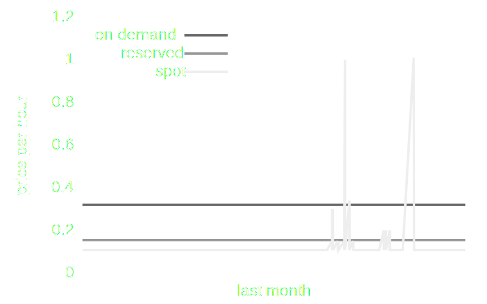
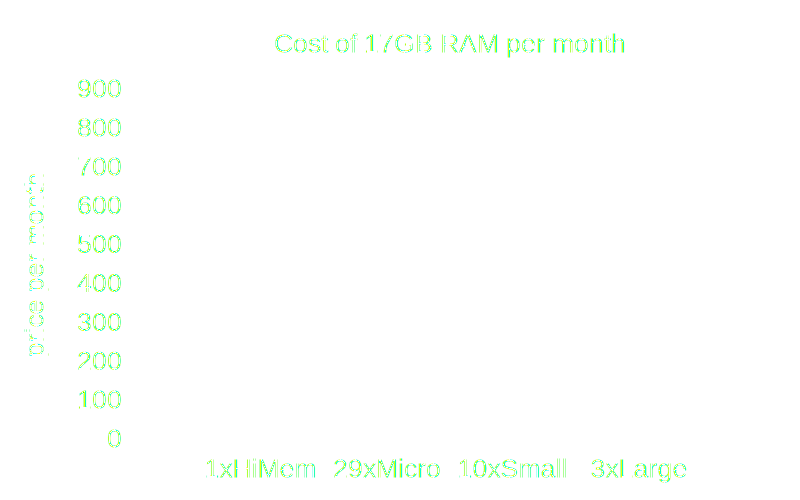
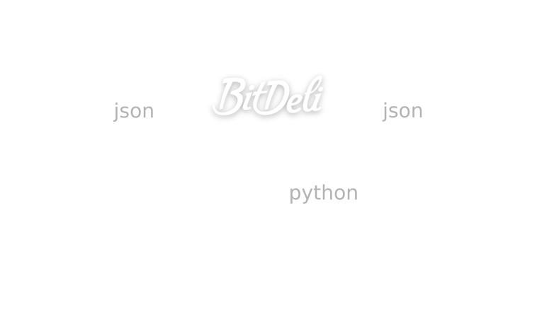
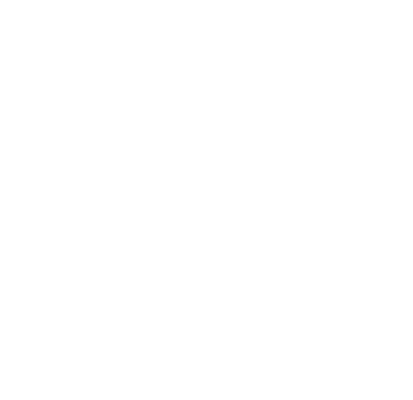
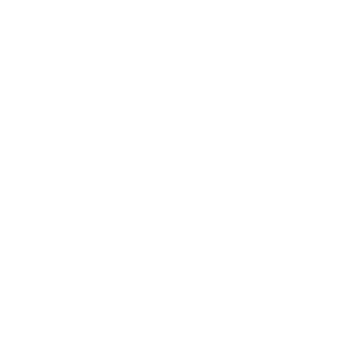
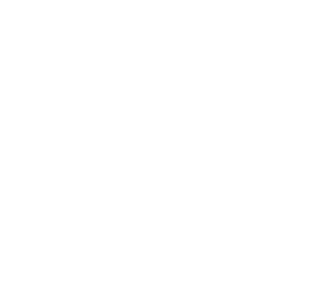

### Data Crunching on a Shoestring Budget
Ville Tuulos

    image

 
developer platform for real-time data  

we &hearts; scripts

    notes

## FAQ
### I want to use 
Riak 
Disco 
MongoDB 
... 
### How should I run it in Amazon EC2?

    notes

## FAQ
### I want to use 
Amazon EC2 
Rackspace 
Softlayer 
... 
### How should I build my system?

    notes

environmental pressure

    notes (doing anything else would be really expensive)

    notes

    notes

<h3 class="principle">
<strong>Cloud</strong> 
Bitdeli 
Erlang 
</h3>

    notes

1) Many Small Short-Living Instances

    notes

<h3 class="principle">1) Many small <strong>short living</strong> instances</h3>
EC2 Annual Uptime Percentage 
##99.95%
21.9 minutes downtime per month 
##Per Region

    notes

<h3 class="principle">1) Many small <strong>short living</strong> instances</h3>
 

    notes

<h3 class="principle">1) <strong>Many small</strong> short living instances</h3>
 

    notes

2) Avoid Disk IO

    notes

<h3 class="principle">2) Avoid <strong>Disk IO</strong></h3>

<h3 class="principle">Local Disk</h3>
unpredictable, requires initialization
<h3 class="principle">Elastic Block Store</h3>
unpredictable, slow
<h3 class="principle">RAID over Elastic Block Store</h3>
complex, expensive

    notes

<h3 class="principle">2) <strong>Avoid</strong> Disk IO</h3>

<pre>
Dear Ville Tuulos,

Your volume experienced a failure
due to multiple failures of the
underlying hardware components
and we were unable to recover it.
...

Sincerely,
EBS Support
</pre>

    notes

3) Separate Workloads

    notes

<h3 class="principle">3) Separate <strong>Workloads</strong></h3>

<table class="workloads">
<thead>
<tr><td>Workload</td><td>Data</td><td>Latency</td><td>Req/Sec</td><td>Cost</td><td>Failing</td></tr>
</thead>
<tbody>
<tr><td>Web Frontend</td><td>&lt;100GB</td><td>&lt;100ms</td><td>1-1000+</td><td>$$</td><td>horrible</td></tr>
<tr><td>Low-Latency</td><td>&lt;1GB</td><td>&lt;500ms</td><td>1-10</td><td>$$</td><td>bad</td></tr>
<tr><td>Batch</td><td>&lt;1TB</td><td>&lt;1h</td><td>0.1-1</td><td>$$$</td><td>ok</td></tr>
<tr><td>Best Effort</td><td>&infin;</td><td>&infin;</td><td>~0</td><td>$</td><td>expected</td></tr>
</tbody>
</table>

    notes

<h3 class="principle">3) <strong>Separate</strong> Workloads</h3>

<table class="workloads">
<thead>
<tr><td>Workload</td><td>RAM</td><td>CPU</td><td># instances</td><td>Type</td></tr>
</thead>
<tbody>
<tr><td>Web Frontend</td><td>1-4GB</td><td>low</td><td>1-3</td><td>VPS / Dedicated</td></tr>
<tr><td>Low-Latency</td><td>&lt;1GB</td><td>spiky</td><td>1-100</td><td>Micro / Small</td></tr>
<tr><td>Batch</td><td>1GB+</td><td>high</td><td>1-10</td><td>Small / Medium</td></tr>
<tr><td>Best Effort</td><td>-</td><td>-</td><td></td><td>-</td></tr>
</tbody>
</table>

    notes

<h3 class="principle">3) Separate Workloads</h3>

Cheapest instance with at least 1GB RAM

<table class="workloads">
<thead>
<tr><td>Provider</td><td>Price/Month</td><td>RAM</td></tr>
</thead>
<tbody>
<tr><td>AWS</td><td>$31</td><td>1.7GB</td></tr>
<tr><td>Linode</td><td>$40</td><td>1GB</td></tr>
<tr><td>Rackspace</td><td>$44</td><td>1GB</td></tr>
<tr><td>SoftLayer</td><td>$50</td><td>1GB</td></tr>
</tbody>
</table>

    notes

4) Antifragility

    notes

<h3 class="principle">4) Antifragility</h3>

<pre style="font-size: 80%">
Just as a package sent by mail can bear a stamp
"fragile", "breakable" or "handle with care",
consider the exact opposite: a package that has
stamped on it "please mishandle" or "please
handle carelessly".
</pre>
Nassim N. Taleb

    notes
    multitenant, check responsiveness, react to region failings

<h3 class="principle">4) Antifragility</h3>

What happens if an instance becomes sluggish? 

<table class="workloads">
<thead>
<tr><td>Type</td><td>Fix</td><td>Latency</td></tr>
</thead>
<tbody>
<tr><td>Dedicated</td><td>manual</td><td>days</td></tr>
<tr><td>VPS</td><td>manual</td><td>hours</td></tr>
<tr><td>Cloud</td><td>automatic (<code>shutdown -h now</code>)</td><td>minutes</td></tr>
</tbody>
</table>

    notes

<h3 class="principle">4) Antifragility</h3>

Crash-Oriented Programming

    notes

<h3 class="principle">
Cloud 
<strong>Bitdeli</strong> 
Erlang 
</h3>

    notes

 

    notes

Bitdeli backend

    notes

1) Many small instances

    notes

2) Avoid Disk IO

    notes

3) Separate Workloads

    notes

4) Antifragility

    notes

<h3 class="principle">
Cloud 
Bitdeli 
<strong>Erlang</strong> 
</h3>

    notes

Why Erlang?

    notes

Fault Model

    notes

Simplicity

    notes

<h3 class="principle">Lessons learned</h3>

    notes

<h3 class="principle">Let the Erlang VM crash</h3>
Hard memory limits 
Out of file descriptors 
Disk hangs 
Competing processes

    notes

<h3 class="principle">Memory Efficiency</h3>
Binaries 
A few tactical NIFs 

    notes

<h3 class="principle">Weak State</h3>

Independent gen\_servers 
gen_servers that reconstruct their state 

    notes

Erlang 
Antifragility 
Challenge

    notes

Can your system survive 
a randomly corrupted state 
in a gen_server? 
 
(aka Chaos Monkey on LSD)

    notes

Thank You 

    notes
